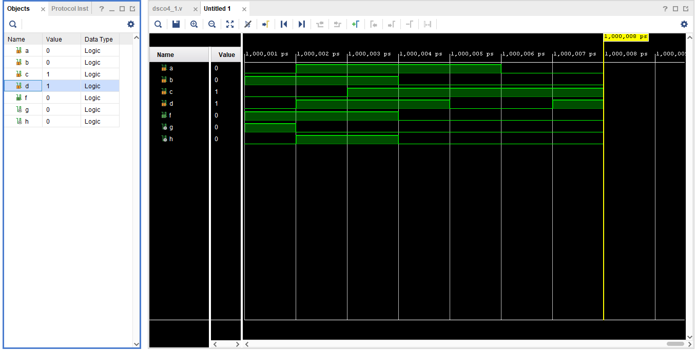

<!-- _class: lead -->
# 📘 Product Documentation with Marp

👩‍💻 Tejaswini Singh  
📧 24f2004718@ds.study.iitm.ac.in  

---

# 📑 Agenda
1. Custom Theme  
2. Page Numbers  
3. Background Image  
4. Custom Styling  
5. Math Equations  

---

<!-- Background image slide -->

# 🌄 Background Image Example

This slide uses a **background image**.  
👉 Make sure `1.png` is in the same repo as `slides.md`.

---

# 🎨 Custom Styling with Directives

<!-- _color: tomato -->
This text is styled with a custom **tomato red** color.  

<!-- _backgroundColor: #f0f8ff -->
This slide has a **light blue background**.  

---

# 🔢 Math Equations

Algorithmic complexity:  

$$
T(n) = O(n \log n)
$$

Another example:  

$$
\frac{d}{dx} \Big( e^x \Big) = e^x
$$

---

# ✅ Summary

- Included **email** in intro  
- Added **custom theme**  
- Enabled **page numbers**  
- Created a slide with **background image**  
- Used **directives for styling**  
- Showed **math equations**  

---

